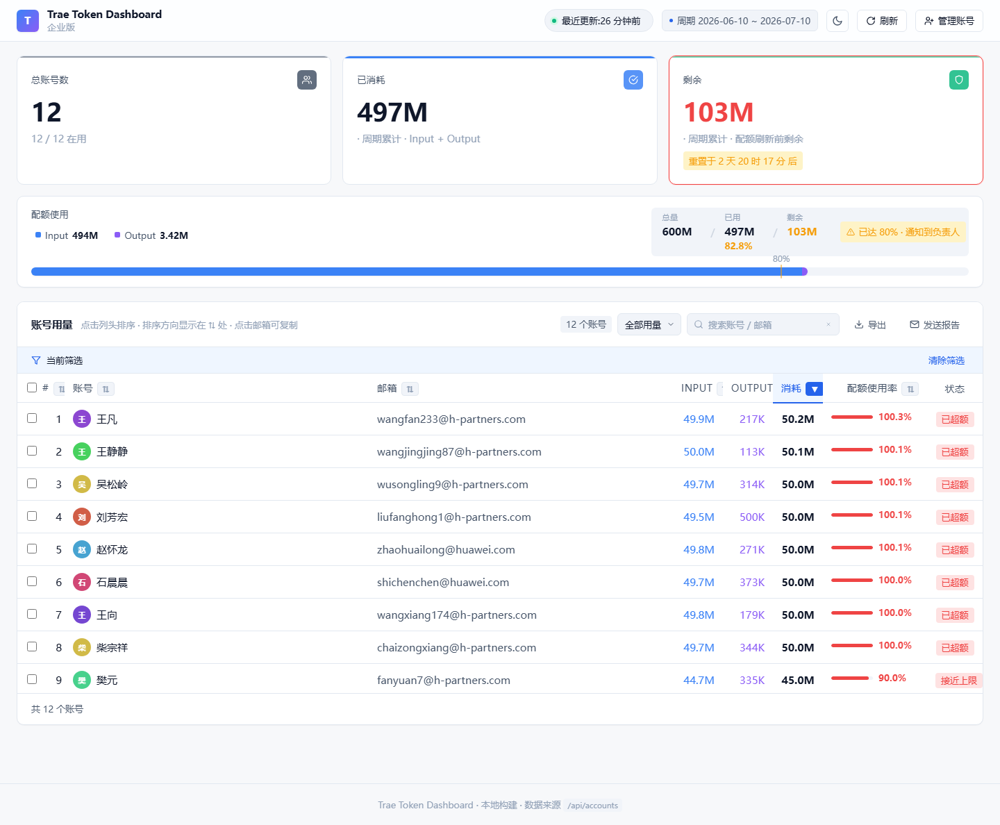
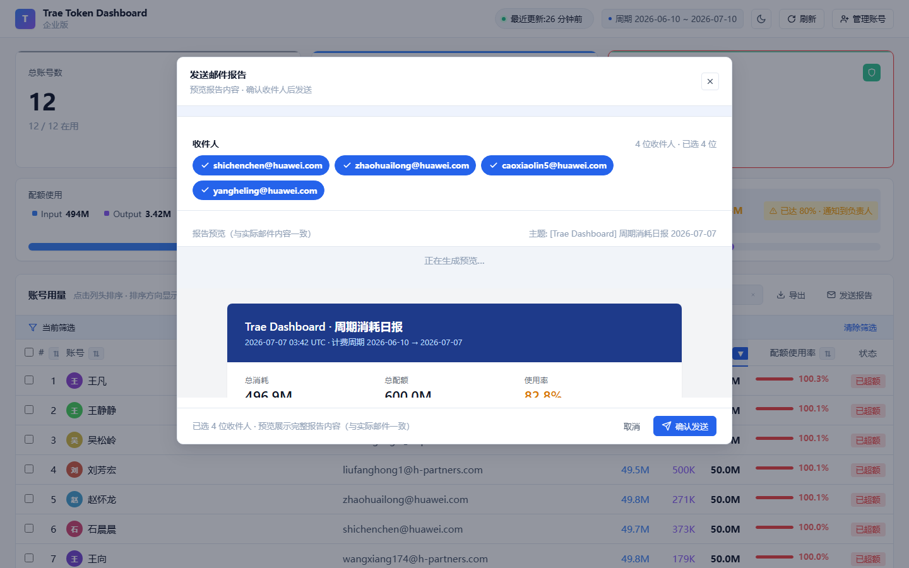
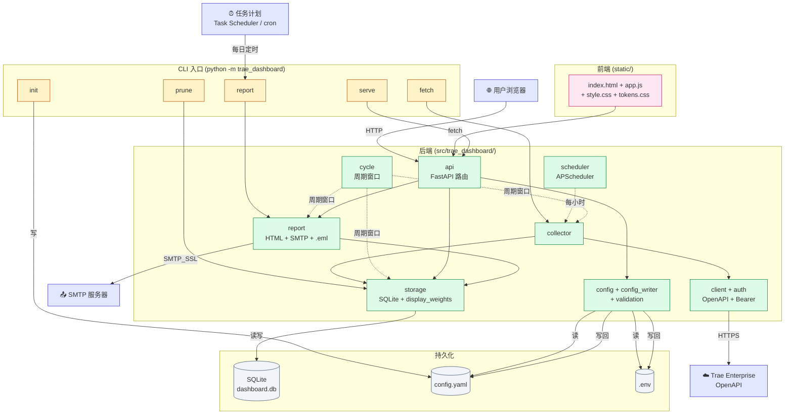

# Trae Token Dashboard

> 一句话:**看 Trae 企业版各账号每个计费周期的 token 消耗,顺便每天自动邮件汇总。**



本地运行的 Web 仪表盘,展示公司所有 Trae 企业版账号的 token 用量,
并支持每日自动把汇总报告通过邮件发给指定收件人。

## 目录

- [它能做什么](#它能做什么)
- [界面长啥样](#界面长啥样)
- [快速开始](#快速开始)
  - [前置要求](#前置要求)
  - [3 步跑起来](#3-步跑起来)
- [配置项](#配置项)
- [日常用法](#日常用法)
- [邮件报告](#邮件报告)
- [HTTP API](#http-api)
- [架构](#架构)
- [常见问题](#常见问题)
- [开发 & 自定义](#开发--自定义)

## 它能做什么

- 📊 **实时面板**:总消耗、总配额、使用率、按账号排行;每账号点开看各模型明细
- 📅 **按周期统计**:对齐 Trae 计费周期(每月 10 号 00:00 UTC 自动重置)
- 💰 **配额追踪**:每账号 50M 默认配额;公司总额 = per_account × 监控账号数
- ⚖️ **展示口径对齐**:Doubao 系列模型按 0.5 系数折算显示(和 Trae 官网一致)
- 📧 **每日邮件报告**:每天定时把汇总表发到指定邮箱
- 🛠 **Web 端配置**:不用改文件,在 dashboard 弹窗里加收件人 / 改 SMTP / 下载 `.eml` 自己发
- 💾 **本地存储**:SQLite 文件,数据全在你机器上
- 🌗 **明暗主题**:跟随系统 + 手动切换

## 界面长啥样

主面板 — 总览 + 账号表 + tooltip:


「发送报告」弹窗 — 预览 + 下载 .eml + 改收件人/SMTP:



(截图是当前真实运行画面,带脱敏)

## 快速开始

### 前置要求

| 依赖 | 最低版本 | 备注 |
|---|---|---|
| Python | 3.11+ | 项目用了 `tomllib` 等 3.11 特性 |
| Trae 企业版账号 | — | 需要「管理员」或「报表查看」角色 |
| SMTP 服务器 | — | 只在要发邮件报告时需要,QQ/163/Gmail 都行 |
| 操作系统 | Windows / macOS / Linux | 任务计划部署在 Windows / cron 部署在 Unix |

### 3 步跑起来

```bash
# 第 1 步:装依赖
git clone <this-repo>
cd traeDashboard
python -m venv .venv
. .venv/bin/activate             # Windows PowerShell: .venv\Scripts\Activate.ps1
pip install -e ".[dev]"

# 第 2 步:登录 Trae 后台拿凭证,写到 .env
#    https://console.enterprise.trae.cn → 创建 App ID + App Secret
cat > .env <<'EOF'
TRAE_APP_ID=<your_app_id>
TRAE_APP_SECRET=<your_app_secret>
# 下面这两个只在要发邮件报告时才需要
SMTP_PASSWORD=<your_smtp_auth_code>
EOF

# 第 3 步:生成配置、拉一次数据、起 Web 服务
python -m trae_dashboard init       # 从 config.example.yaml 复制生成 config.yaml
# 编辑 config.yaml:填 accounts(要监控的邮箱列表)+ email.*(要发邮件时)
python -m trae_dashboard fetch      # 手动拉一次数据,写入 SQLite
python -m trae_dashboard serve      # 起 Web 服务 → http://127.0.0.1:8765
```

浏览器访问 `http://127.0.0.1:8765`,看到 dashboard = 成功。

> 💡 默认端口 8765。如需改:`python -m trae_dashboard serve --port 8000`

## 配置项

**两个配置文件:`config.yaml`(应用配置)和 `.env`(密钥)**。

### `config.yaml` 字段

| YAML key | 必填 | 默认 | 说明 |
|---|---|---|---|
| `openapi_base` | ✓ | `https://openapi.enterprise.trae.cn` | Trae OpenAPI host |
| `auth_endpoint` | ✓ | `/openapi/v1/auth/access_token` | 鉴权端点(相对路径) |
| `db_path` | — | `data/dashboard.db` | SQLite 文件路径 |
| `fetch_interval_minutes` | — | `60` | 后台拉取间隔(仅 `--with-scheduler` 模式生效) |
| `per_account_quota` | — | `50000000` | 每账号配额(50M tokens) |
| `included_model_names` | — | 内置官方列表 | 严格白名单;非列表中的 API 响应不持久化 |
| `accounts[]` | ✓ | (空) | **要监控的邮箱列表,建议 ≤ 20** |
| `email.enabled` | — | `false` | 是否启用邮件报告 |
| `email.smtp_host` | ⚠ | — | SMTP 服务器;启用 email 时必填 |
| `email.smtp_port` | — | `465` | SMTP SSL 端口 |
| `email.smtp_user` | ⚠ | — | SMTP 登录账号;启用 email 时必填 |
| `email.smtp_password_env` | ⚠ | `SMTP_PASSWORD` | `.env` 中存放 SMTP 密码的变量名;启用 email 时必填 |
| `email.from_addr` | ⚠ | — | 邮件 From 头(通常 = smtp_user);启用 email 时必填 |
| `email.recipients[]` | ⚠ | (空) | 收件人邮箱列表;启用 email 时必填 |
| `email.send_time` | — | `"09:00"` | 仅文档用,实际触发由任务计划控制 |

> 图例:✓ 必填,⚠ 启用 email 时必填,— 可选

### `.env` 字段

| 变量名 | 必填 | 说明 |
|---|---|---|
| `TRAE_APP_ID` | ✓ | Trae 后台申请的 App ID |
| `TRAE_APP_SECRET` | ✓ | Trae 后台申请的 App Secret(小心别 commit 进 git) |
| `SMTP_PASSWORD` | ⚠ | SMTP 授权码(QQ 邮箱:设置 → 账户 → 开启 SMTP → 生成授权码);只在启用邮件报告时需要 |

> 不想手改 `.env`?在 dashboard 弹窗 → 「邮件设置」Tab → 「修改密码」也能写。

## 日常用法

### 添加 / 删除监控账号

两种方式都可以:

**A. 改 config.yaml**(适合初次部署、改一批账号):

```yaml
accounts:
  - email: alice@company.com
    display_name: 爱丽丝
  - email: bob@company.com
```

改完不需要重启 — 下次 fetch 或 refresh 时生效。

**B. Web 弹窗**:点页面右上「账号管理」按钮 → 输入邮箱 → 「添加」。

### 手动刷新数据

dashboard 顶部 `刷新` 按钮 → 立刻拉一次最新数据。等不及任务计划的 1 小时就用这个。

### 修改 SMTP / 收件人

不用改文件。点 header 区域「发送报告」按钮 → 切到「**邮件设置**」Tab → 改完点保存 → 立即生效。

### 导出 .eml 自己发

点「发送报告」→「下载 .eml」→ 浏览器下载 `trae-report-YYYY-MM-DD.eml` →
双击用 Outlook / Foxmail 打开 → To 已预填 → 自己加附件 / CC 发出。

> 适用场景:SMTP 凭据没配、或想加额外内容、或临时只发给某几个人。

## 邮件报告

### 方式 A:CLI 触发(任务计划)

`report` 是一次性命令,配合系统任务计划做每日自动发送。

**Windows 任务计划**(管理员 PowerShell):

```powershell
# 注册(每天 09:00 触发,日志写到 data\report_task.log)
schtasks /create /tn "TraeDashboardDailyReport" `
  /tr "cmd /c C:\python\python.exe -m trae_dashboard report > E:\traeDashboard\data\report_task.log 2>&1" `
  /sc daily /st 09:00 /f

# 立即手动触发
Start-ScheduledTask -TaskName "TraeDashboardDailyReport"

# 查看上次执行结果
Get-ScheduledTaskInfo -TaskName "TraeDashboardDailyReport"

# 删除任务
schtasks /delete /tn "TraeDashboardDailyReport" /f
```

**Linux / macOS cron**:

```cron
0 9 * * * cd /path/to/traeDashboard && /path/to/python -m trae_dashboard report >> data/report_task.log 2>&1
```

> 💡 任务以交互登录用户身份跑时,需保持桌面已登录;若需「未登录也跑」,改用 `SYSTEM` 账户 + 配好 `.env` 读取路径。

### 方式 B:Web 弹窗手动触发

header 区域「发送报告」按钮 → 「确认发送」(走应用内 SMTP)或「下载 .eml」(本地邮件客户端发)。

### 方式 C:dry-run 预览(不发)

```bash
python -m trae_dashboard report --dry-run
```

渲染 HTML 打印到 stdout,可重定向到文件在浏览器看:

```bash
python -m trae_dashboard report --dry-run > /tmp/preview.html
```

## HTTP API

完整 schema 见 [`src/trae_dashboard/api.py`](src/trae_dashboard/api.py)。下表是常用端点:

| 端点 | 方法 | 用途 |
|---|---|---|
| `/api/health` | GET | 健康检查,返回 `{ok: true}` |
| `/api/version` | GET | 当前服务 commit SHA(排查"是不是最新代码") |
| `/api/status` | GET | 周期窗口、quota、consumed、remaining、利用率、最近抓取时间 |
| `/api/accounts` | GET | 每账号周期总额 + 配额使用率 + per-model 明细(给 tooltip 用) |
| `/api/accounts` | POST | 新增监控账号(`{email, display_name?}`),重复返 409 |
| `/api/accounts/{email}` | DELETE | 删除账号(级联删除其 model_usage,保留 snapshots),幂等 |
| `/api/accounts/{email}/history` | GET | 单账号 per-model 明细 |
| `/api/refresh` | POST | 触发一次后台采集(同步返回) |
| `/api/report/config` | GET | SMTP + 收件人配置(读,无密码) |
| `/api/report/recipients` | PUT | 全量覆盖收件人列表 |
| `/api/report/smtp` | PUT | 更新 SMTP 5 字段(主机/端口/用户/发件邮箱/发送时间) |
| `/api/report/smtp/password` | POST | 写 SMTP 密码到 `.env`(响应不回密码) |
| `/api/report` | POST | 触发一封邮件报告(同步返回) |
| `/api/report/eml` | GET / POST | 下载 RFC-822 `.eml` 文件(`To` 用 `recipients` 参数预填) |

## 架构



**三大数据流**:

1. **拉数据**:Trae OpenAPI → `client.py` → `collector.py` → `storage.py` → SQLite。触发方式:`serve --with-scheduler` 每小时,或 `python -m trae_dashboard fetch` 手动。
2. **展示数据**:浏览器 → `index.html`(静态)→ `/api/*` → `storage.py`(读路径应用 `display_weights` 加权)→ SQLite。
3. **邮件报告**:触发源 → `report.py` → `storage.py`(读当前周期)+ SMTP 发送 / `.eml` 导出。

完整版架构图(节点说明 + 字段级注释)见 [`docs/architecture.md`](docs/architecture.md)。

## 常见问题

<details>
<summary><b>Q: 「Access denied / 401」— 拉不到数据</b></summary>

- 检查 `.env` 里 `TRAE_APP_ID` / `TRAE_APP_SECRET` 没填错、没多空格
- 在 Trae 后台确认 App 还「启用」状态,Secret 没被重置过
- App 没勾选「用户模型用量」权限 → 后台 → 应用 → 权限管理
</details>

<details>
<summary><b>Q: 端口 8765 被占用</b></summary>

```bash
# 找占用进程
netstat -ano | findstr :8765          # Windows
lsof -i :8765                          # macOS / Linux

# 换端口启动
python -m trae_dashboard serve --port 8000
```
</details>

<details>
<summary><b>Q: SMTP 发不出去 / 认证失败</b></summary>

- QQ 邮箱:`SMTP_PASSWORD` 不是登录密码,是「设置 → 账户 → 开启 POP3/SMTP → 生成授权码」那个
- Gmail:需要「应用专用密码」,不能直接用账户密码
- 检查 `email.smtp_user` 跟 `from_addr` 一致
- 端口不是 25(我们用 SSL 465,代码写死)
</details>

<details>
<summary><b>Q: SQLite database is locked</b></summary>

后台 scheduler 和手动 fetch / 刷新不能同时跑(共享 SQLite)。一般等几秒重试就行。
要是持续锁,关掉所有 `python -m trae_dashboard serve` / `fetch` 进程再试。
</details>

<details>
<summary><b>Q: 数据看起来不对 / 跟 Trae 官网数字不一致</b></summary>

- 确认 `config.yaml` 里 `accounts[]` 跟 Trae 后台看的账号列表一致(大小写、域名)
- `display_weights` 默认把 Doubao-Seed-Code × 0.5 — 这是为了跟官网 UI 一致;如果不想加权,把它改成空 dict
- 周期窗口不对?今天是 7 号 < 10 号,看的是「上月 10 号 ~ 今天」的累计
</details>

<details>
<summary><b>Q: 升级后端口仍是 8765 但页面异常</b></summary>

浏览器 cache 了旧 JS。按 `Ctrl+Shift+R` 硬刷新一次。
如果还有问题,运行 `verify-eml.bat`(项目根目录)做 5 项自检。
</details>

<details>
<summary><b>Q: 想监控超过 20 个账号</b></summary>

OpenAPI 单次请求限制 20 邮箱。代码内部按 20/批循环拉(见 `client.py`)。
实测 100 账号也能跑,只是 fetch 慢一些。
</details>

## 开发 & 自定义

### 测试

```bash
pytest                              # 全部测试(应 171+ 通过)
pytest --cov=trae_dashboard         # 覆盖率
ruff check src/ tests/              # lint
black --check src/ tests/           # format
```

### 加新模块

`src/trae_dashboard/` 下创建 `xxx.py`,在 `cli.py` 加子命令,在 `api.py` 加路由。
新模块如果走 OpenAPI,记得在 `client.py` 加方法。

### 设计文档

- 架构详解:[`docs/architecture.md`](docs/architecture.md)
- 计划 / 设计:[`docs/plans/`](docs/plans/)(`2026-07-16-email-report-enhancement-*.md` 是最近的邮件功能增强)

### 故障自检

跑 `verify-eml.bat`(Windows)做 5 项端到端检查并打印 PASS/FAIL。

## 兼容性

- Python **3.11+**(用 `tomllib`、`datetime.UTC` 等)
- Windows / macOS / Linux 都支持
- 浏览器:Chrome / Edge / Firefox / Safari 最近 2 个大版本

## License

MIT

## Docker 一键部署

> 需要本机装有 Docker Desktop(Windows/macOS)或 Docker Engine(Linux)。

**前置:** 项目根目录先备好 `config.yaml` 和 `.env`(见「快速开始」第 2/3 步;没有的话先
`cp config.example.yaml config.yaml`、`cp .env.example .env` 再填好)。

```bash
# 一键构建并启动 → http://127.0.0.1:8888
docker compose up -d --build

docker compose logs -f     # 看日志
docker compose down        # 停止(数据保留在 named volume 里)
docker compose up -d       # 再次启动
```

**行为说明:**

- 容器启动时先自动拉一次数据(`fetch`),之后按 `fetch_interval_minutes` 后台定时采集(`--with-scheduler`)。
- `config.yaml` / `.env` 直接挂载自宿主机,**可写** —— 面板里的「账号管理 / 邮件设置」写回功能在容器内照常生效。
- SQLite 数据存在 named volume `trae-dashboard-data` 里,`docker compose down` 不丢。
- 端口映射 `127.0.0.1:8888:8765`:仅本机可访问(容器内绑 0.0.0.0,外部由 compose 收敛到本机)。
- 邮件日报**不在**容器内调度,保持外部 cron / 手动触发(与源码部署一致)。

> Linux 主机小提示:若面板写回配置时遇到权限问题(挂载文件属主是 root),执行
> `sudo chown 1000:1000 config.yaml .env` 后重启容器即可(Docker Desktop 一般无此问题)。