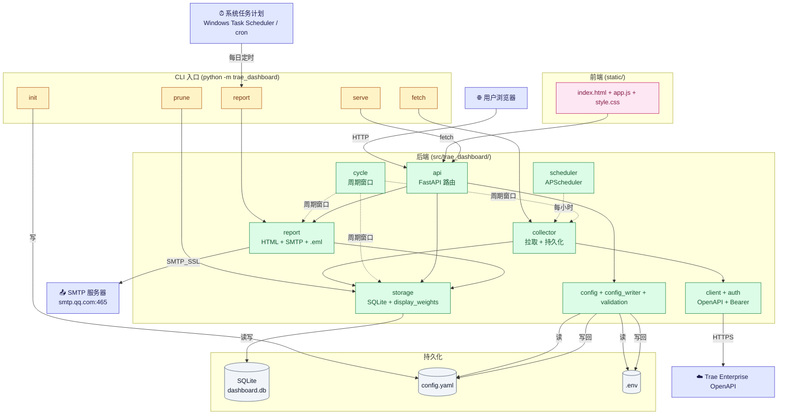

# Trae Token Dashboard

本地 Web 仪表盘，监控 Trae 企业版账号的 **Token 消耗**（input + output）。每账号配额 5000 万；按当前计费周期（每月 10 号 ~ 下月 10 号）展示消耗、剩余、配额使用率，并可每日自动把汇总报告通过邮件发到指定收件人。

## 特性

- 🎯 **企业版 OpenAPI 直连**：通过 `App ID + App Secret` 鉴权，调用 `/openapi/v1/statistics/user-model-usage` 端点
- 📅 **按周期统计**：每月 10 号 00:00 UTC 自动重置；今天 < 10 号时取上月 10 号起
- 💰 **每账号配额**：50M tokens / cycle；公司总 = per_account × 活跃账号数
- 🧮 **展示加权**：Doubao 系列模型按 0.5 系数折算展示（与官网口径对齐，原始值仍保留在 DB）
- 🔄 **后台定时拉取**：APScheduler 每小时同步（可选，`serve --with-scheduler` 开启）
- 💾 **本地 SQLite 存储**：WAL 模式，所有数据持久化
- 🎨 **纯前端**：vanilla HTML + JS，无构建步骤
- 🌗 **明暗主题**：自动跟随系统 + 手动切换
- 💡 **行内 Tooltip**：鼠标悬浮"消耗"列展示该账号各模型 input/output 明细
- 📧 **每日邮件报告**：`report` 子命令渲染 HTML 表格通过 SMTP 发送，配合 Windows 任务计划 / cron 每日触发；header 一键触发手动发送
- 🛠 **账号管理 Modal**：在 Web 界面新增 / 删除监控账号，type-to-confirm 防误删，cascade 删除 model_usage
- 🧹 **`prune` 命令**：清理零数据账号 + 过期快照

## 快速开始

```bash
# 1. 安装
python -m venv .venv
. .venv/bin/activate  # Windows: .venv\Scripts\activate
pip install -e ".[dev]"

# 2. 准备凭证
# 登录 https://console.enterprise.trae.cn 创建 App ID + App Secret
# 写到 .env：
cat > .env <<'EOF'
TRAE_APP_ID=<your_app_id>
TRAE_APP_SECRET=<your_app_secret>
SMTP_PASSWORD=<your_smtp_auth_code>   # 可选，启用邮件报告时需要
EOF

# 3. 生成 config.yaml 并启动
python -m trae_dashboard init      # 从 config.example.yaml 复制生成 config.yaml
python -m trae_dashboard fetch     # 拉一次数据
python -m trae_dashboard serve     # 起 web 服务 (http://127.0.0.1:8765)
```

## 配置项

| YAML key | 默认 | 说明 |
|---|---|---|
| `openapi_base` | `https://openapi.enterprise.trae.cn` | OpenAPI host |
| `auth_endpoint` | `/openapi/v1/auth/access_token` | 认证端点 |
| `db_path` | `data/dashboard.db` | SQLite 文件路径 |
| `fetch_interval_minutes` | `60` | 后台拉取间隔 |
| `per_account_quota` | `50000000` | 单账号配额（50M） |
| `included_model_names` | (内置官方列表) | 严格匹配白名单的模型名；非列表中的 API 响应不持久化、不计入统计 |
| `accounts[]` | (空) | 邮箱列表（建议 ≤ 20） |
| `email.enabled` | `false` | 是否启用邮件报告 |
| `email.smtp_host` / `smtp_port` | — | SMTP 服务器地址 / 端口（SSL） |
| `email.smtp_user` | — | SMTP 登录账号 |
| `email.smtp_password_env` | `SMTP_PASSWORD` | 存放 SMTP 授权码的环境变量名（避免明文进 git） |
| `email.from_addr` | — | 邮件 From 头，通常与 `smtp_user` 相同 |
| `email.recipients[]` | (空) | 收件人邮箱列表 |
| `email.send_time` | `"09:00"` | 仅文档用，实际触发由任务计划 / cron 控制 |

环境变量：
- `TRAE_APP_ID` / `TRAE_APP_SECRET`：必填（OpenAPI 鉴权凭证）
- `SMTP_PASSWORD`：可选（启用邮件报告时必填，SMTP 授权码）

## CLI

| 命令 | 作用 |
|---|---|
| `python -m trae_dashboard init` | 写 `config.example.yaml` 到 `config.yaml` |
| `python -m trae_dashboard fetch` | 跑一次完整 fetch + 落库 |
| `python -m trae_dashboard serve` | 起 web 服务（默认不开后台 scheduler，靠手动点刷新） |
| `python -m trae_dashboard serve --with-scheduler` | 起 web 服务 + 后台每小时自动拉取 |
| `python -m trae_dashboard prune` | 清理零数据账号 + 旧 snapshot |
| `python -m trae_dashboard prune --dry-run` | 只报告要删什么，不实际删 |
| `python -m trae_dashboard prune --keep-snapshots 10` | 保留最近 10 个 snapshot |
| `python -m trae_dashboard report` | 渲染并发送当日邮件报告（需配置 `email` 段） |
| `python -m trae_dashboard report --dry-run` | 只渲染 HTML 打印到 stdout，不发送（预览用） |

## 邮件报告部署

`report` 是一次性命令，配合系统任务计划实现每日自动发送。

**Windows 任务计划**（管理员 PowerShell）：
```powershell
# 注册（每天 09:00 触发，日志写到 data\report_task.log）
schtasks /create /tn "TraeDashboardDailyReport" `
  /tr "cmd /c C:\python\python.exe -m trae_dashboard report > E:\traeDashboard\data\report_task.log 2>&1" `
  /sc daily /st 09:00 /f

# 立即手动触发
Start-ScheduledTask -TaskName "TraeDashboardDailyReport"

# 查看上次执行结果
Get-ScheduledTaskInfo -TaskName "TraeDashboardDailyReport"

# 删除任务
schtasks /delete /tn "TraeDashboardDailyReport" /f
```

**Linux / macOS cron**：
```cron
0 9 * * * cd /path/to/traeDashboard && /path/to/python -m trae_dashboard report >> data/report_task.log 2>&1
```

> 提示：任务以交互式登录用户身份运行时，需保证运行时已登录桌面；若需"未登录也跑"，请改用 `SYSTEM` 账户并配置好环境变量 / `.env` 读取路径。

### 在 UI 里修改收件人 / SMTP 配置

「发送报告」弹窗里有两个 Tab:

- **发送**: 选收件人 + 预览 + 「下载 .eml」/「确认发送」。
- **邮件设置**: 增删收件人并保存; 编辑 SMTP 主机/端口/用户/发件邮箱/发送时间; 单独入口修改 SMTP 密码(写到 `.env`); 启用开关为只读(关闭需手改 `config.yaml`)。

所有修改都立即生效(无需重启服务)。

## HTTP API

| 端点 | 方法 | 返回 |
|---|---|---|
| `/api/health` | GET | `{ok}` |
| `/api/status` | GET | 周期窗口、quota、consumed、remaining、utilization_pct、最后抓取时间 |
| `/api/accounts` | GET | 每账号周期总额 + 配额使用率 + per-model 明细（用于 tooltip） |
| `/api/accounts` | POST | 新增监控账号（body: `email`, `display_name?`），重复返回 409 |
| `/api/accounts/{email}` | DELETE | 删除账号（级联 model_usage，保留 snapshots），幂等 |
| `/api/accounts/{email}/history` | GET | 单账号 per-model 明细 |
| `/api/refresh` | POST | 触发一次后台采集（同步返回） |
| `/api/report` | POST | 触发一封邮件报告（同步返回） |

完整 schema 见 `src/trae_dashboard/api.py`。

## 架构



**图例**:
- 实线 → 直接调用 / 同步数据流;虚线 `-.->` 间接依赖 / 定时触发
- 蓝色=外部系统,黄色=CLI,绿色=后端模块,粉色=前端,灰色=存储

**三大数据流**:

1. **拉数据**:Trae OpenAPI → `client.py` → `collector.py` → `storage.py` → SQLite。触发方式:`serve --with-scheduler` 每小时调,或 `python -m trae_dashboard fetch` 手动。
2. **展示数据**:浏览器 → `index.html`(静态)→ `/api/*` → `storage.py`(读路径应用 `display_weights` 加权)→ SQLite。静态文件由 `api.py` 的 `mount("/")` 提供。
3. **邮件报告**:触发源 → `report.py` → `storage.py`(读当前周期)+ SMTP 发送 / `.eml` 导出。触发源:CLI `report`、Web `POST /api/report`、Web `GET|POST /api/report/eml` 下载本地。

**配置写回**:前端「邮件设置」Tab → `api.py` → `config_writer.py` → 写回 `config.yaml` / `.env`,无需重启服务即时生效。

完整版(含每个子图细节 + 字段说明)见 [`docs/architecture.md`](docs/architecture.md)。

## 项目结构

```
traeDashboard/
├── pyproject.toml
├── README.md
├── config.example.yaml          # 配置模板（含 email 段示例）
├── .env.example                 # 环境变量模板
├── data/
│   ├── dashboard.db             # SQLite（运行时生成）
│   └── report_task.log          # 邮件任务日志（运行时生成）
├── src/trae_dashboard/
│   ├── api.py                   # FastAPI 路由
│   ├── auth.py                  # Bearer Token 管理
│   ├── cli.py                   # 命令行入口
│   ├── client.py                # Trae OpenAPI 客户端
│   ├── collector.py             # 数据采集器
│   ├── config.py                # 配置加载（含 EmailConfig）
│   ├── cycle.py                 # 周期窗口计算
│   ├── report.py                # 邮件渲染 + SMTP 发送
│   ├── scheduler.py             # APScheduler 后台拉取
│   ├── storage.py               # SQLite 存储（含 display_weights 加权读路径）
│   └── static/                  # 前端
│       ├── index.html
│       ├── app.js
│       ├── style.css
│       └── tokens.css
└── tests/                       # 142 个测试
```

## 验收清单

- [x] `python -m trae_dashboard init` 写入示例配置
- [x] `python -m trae_dashboard fetch` 成功并写入 SQLite
- [x] `python -m trae_dashboard serve` 监听 127.0.0.1:8765
- [x] 浏览器看到 3 个 KPI 卡 + 配额条 + 账号表格
- [x] 数据 = Trae UI 显示的周期总额（无 per-day 失真）
- [x] Doubao 系列模型按 0.5 加权展示，与官网口径一致
- [x] 鼠标悬浮"消耗"列显示各模型明细 tooltip
- [x] 主题切换（明 / 暗）工作
- [x] `python -m trae_dashboard report --dry-run` 渲染 HTML 正常
- [x] `python -m trae_dashboard report` 真实发送邮件成功
- [x] Windows 任务计划每日 09:00 触发，日志写入 `data/report_task.log`
- [x] 浏览器控制台无错误
- [x] 所有 pytest 用例通过
- [x] 账号管理 Modal：新增 / 删除 + type-to-confirm 防误删
- [x] 数据陈旧时 header 显式文字提示（>1h 变橙 + "较旧,请刷新"）
- [x] 配额 = 0 时 quota bar 灰空 + KPI 显示"未配置"（不再误判"已超额"）

## 测试 & 代码质量

```bash
pytest                          # 全部通过
pytest --cov=trae_dashboard     # 覆盖率
ruff check src/ tests/          # lint
black --check src/ tests/       # format
```

## License

MIT
