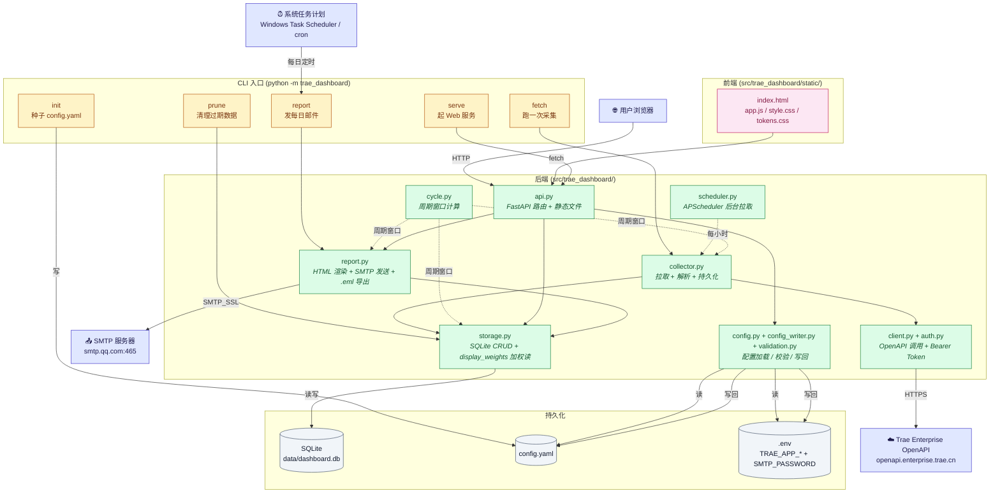

# 架构图(原始 Mermaid 源)

下面是 README 里嵌入的架构图的 Mermaid 源,GitHub / VS Code 都能直接渲染。

## 主架构图



## 图例

| 箭头 | 含义 |
|---|---|
| 实线 `→` | 直接调用 / 同步数据流 |
| 虚线 `-.->` | 间接依赖 / 定时触发 |
| 蓝色 | 外部系统 / 服务 |
| 黄色 | CLI 命令 |
| 绿色 | 后端模块 |
| 粉色 | 前端 |
| 灰色 | 持久化存储 |

## 主要数据流(三个)

### 1. 拉数据 — 定时 / 手动

```
Trae OpenAPI  ─►  client.py  ─►  collector.py  ─►  storage.py  ─►  SQLite
                       ▲
                       │
              auth.py (Bearer Token 缓存)
                       ▲
                       │
            .env (TRAE_APP_ID + TRAE_APP_SECRET)
```

触发方式:
- `serve --with-scheduler` → APScheduler 每小时调一次 collector
- `python -m trae_dashboard fetch` → CLI 手动跑一次

### 2. 展示数据 — 浏览器拉

```
浏览器 ─► index.html (静态) ─► /api/* ─► storage.py ─► SQLite
                  ▲
                  │ 静态文件由 api.py 的 mount("/") 提供
                  │
            FastAPI 路由 (api.py)
                  │
        ┌─────────┼─────────┐
        │         │         │
     /status   /accounts  /report
```

读路径上 `storage.py` 应用 `display_weights` 加权(Doubao-Seed-Code × 0.5),对齐 Trae 官网展示口径。

### 3. 邮件报告

```
触发源 ─► report.py ─┬─► storage.py  (读当前周期)
                     │
                     ├─► build_eml   (返回 RFC822 .eml 给 API 下载)
                     ├─► SMTP_SSL    (实际发邮件到收件人)
                     │
                     └─► render_html (内部,拼 HTML 表格)
```

触发源:
- `python -m trae_dashboard report` CLI(被 Windows 任务计划 / cron 每天 09:00 调)
- Web 端 `POST /api/report`(弹窗点"确认发送")
- Web 端 `POST /api/report/eml` 或 `GET /api/report/eml`(下载 .eml 后用本地邮件客户端发)